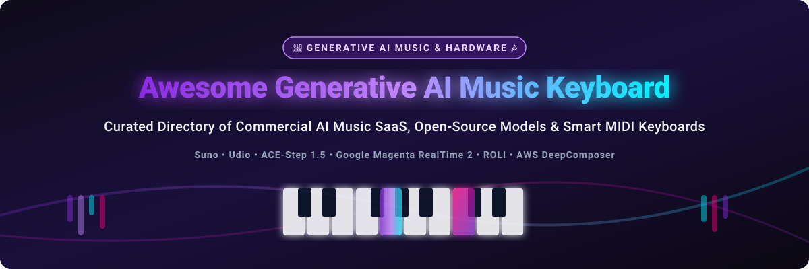

# Awesome-Generative-AI-Music-Keyboard 🎹 🎶

  

  
  
  
  
  
  

---

## 🌟 Top Generative AI Music Keyboard & Audio AI Ecosystem 🎹 🎧

**Curated Directory of Commercial AI Music SaaS Platforms, Open-Source Music Generation Frameworks & Smart Hardware MIDI Keyboards** 🎶

*Focused on Real-Time Audio Generation, Symbolic MIDI Composition, Deep Learning Keyboards, Audio Diffusion Models & Self-Hosted AI Music Stack*

**Last updated: October 2026** 📅 🚀

---

### 📌 Overview & SEO Summary 🔍

Welcome to the definitive curated ecosystem guide for **generative AI music keyboards**, **open-source AI music generation models**, and **hardware-integrated MIDI instruments**. Generative AI music technology allows musicians, developers, and creators to generate complete multi-instrumental compositions, steer live audio via key-press conditioning, generate full vocal tracks from text prompts, and automate chord progressions.

Whether you are evaluating top commercial SaaS platforms (*Suno*, *Udio*, *AIVA*), hardware MIDI keyboards with ML controllers (*ROLI Piano + Airwave*, *AWS DeepComposer*), or running local self-hosted open-source models (*AudioCraft / MusicGen*, *Google Magenta*, *ACE-Step 1.5*), this directory provides comprehensive pricing, free tier limits, star counts, and technical specs. 🎼 ⚡

**Key Market Insights:** 💡
- 📈 **Market Size & Structure:** The global AI music generation market is estimated at **$1.2 Billion in 2026** and projected to reach **$4.8 Billion by 2030** (CAGR ~32%). The sector is currently **moderately fragmented**, with high capital concentration at the foundation model tier (e.g. Suno valued at $5.4B), while specialized workflows (DAW plugins, local inference, hardware controllers) remain vibrant and competitive.
- 🎹 **Real-Time Latency Standard:** Modern models like **Google Magenta RealTime 2** achieve **~0.2s control delay** (40ms frame conditioning at 25 Hz), enabling live human-in-the-loop performance on physical keyboards.
- 💻 **Local Music AI Revolution:** **ACE-Step 1.5** and **AudioCraft MusicGen** deliver state-of-the-art text-to-music generation on consumer GPUs with local privacy and zero API fees.

---

## 📑 Table of Contents 📜

- [🏢 SaaS & Commercial Platforms](#-saas--commercial-platforms)
- [🔓 Open-Source GitHub Projects](#-open-source-github-projects)
- [🛠️ How to Contribute](#%EF%B8%8F-how-to-contribute)
- [📊 Star History](#-star-history)
- [🤝 Support & Sponsorship](#-support--sponsorship)
- [⚠️ Disclaimer](#%EF%B8%8F-disclaimer)

---

## 🏢 SaaS / Commercial Platforms 🌐 💰

> **Market Dynamics:** The generative AI music platform market is valued at ~$1.2B in 2026 and exhibits **moderate fragmentation**, transitioning toward high concentration in full-song consumer platforms (Suno, Udio) while maintaining specialized niches for soundtrack creation (AIVA), royalty-free library generation (Soundraw, Mubert), and AI-integrated hardware controllers (ROLI, PopuPiano).

| SaaS / Commercial Platform | Company / Owner | Valuation / Market Cap / Funding / Revenue | Standard Edition Starting Price | Free Tier / Free Trial Limits | Description |
| :--- | :--- | :--- | :--- | :--- | :--- |
| **[AWS DeepComposer](https://aws.amazon.com/deepcomposer/)** ⚠️ | Amazon | ~$2.0 Trillion Market Cap | **Service ended September 17, 2025** ($99 hardware) | **12-month free tier included 30 days of service & 1,500 model runs** (Service Discontinued) | **ML-powered music keyboard (discontinued)** — **32-key, 2-octave MIDI keyboard** with arpeggiator, auto-chord, pitch/mod wheels. **Hardware still works as standard MIDI keyboard with any DAW**. 🎹 |
| **[Suno](https://suno.com/)** 🎶 | Suno | ~$5.4 Billion Valuation ($300M ARR) | **Pro: $10/month** ($8/mo billed annually) | **Free: 50 credits/day (~10 songs/day, non-commercial)** | **AI music generation platform** — **Generates complete songs with vocals** from text prompts. **v5 model delivers better lyric coherence and sound quality**. **Suno Studio for light DAW-style editing**. 🎤 |
| **[Boomy](https://boomy.com/)** 🎵 | Boomy | ~$80 Million Valuation ($20M Funding) | **Creator: $9.99/month** | **Free: 25 song saves, non-commercial personal use** | **Instant song creation** — **Pick a style, click generate, and release to Spotify**. **Earn royalties from AI-generated tracks**. 🎧 |
| **[ROLI Piano + Airwave](https://roli.com/)** 🎹 | ROLI | ~$79.4 Million Raised (Private) | **$758** (Piano + Airwave Bundle) | **30-day trial of ROLI Learn app** (Hardware required) | **AI-powered music keyboard system** — **49-key MPE keyboard with light-up keys** and **Airwave hand-tracking camera**. **Piano A.I. Assistant for learning and composition**. ✨ |
| **[Udio](https://www.udio.com/)** 🎛️ | Udio | ~$40 Million Valuation ($10M Seed) | **Standard: $10/month** ($8/mo billed annually) | **Free: 10 credits/day + 100 bonus credits/month (~100 songs/mo)** | **Production-oriented AI music** — **Timeline editing, inpainting for fixing specific sections**, and **stem downloads on paid plans**. **Excellent instrumental quality and arrangement detail**. 🔊 |
| **[Soundraw](https://soundraw.io/)** 🔊 | Soundraw | ~$3.0 Million Funding (Private) | **Creator: $16.99/month** ($13.99/mo billed annually) | **Free: Unlimited track generations, 0 downloads/exports** | **Royalty-free AI music generator** — **Generate unlimited music and customize length, structure, and instruments**. 🎼 |
| **[Mubert](https://mubert.com/)** 🌊 | Mubert | ~$2.6 Million Funding (Private) | **Creator: $14/month** ($11.69/mo billed annually) | **Free: 25 track generations/month, non-commercial with attribution** | **Generative music for content creators** — **Royalty-free music for videos, podcasts, and streams**. 🌊 |
| **[AIVA](https://www.aiva.ai/)** 🎼 | AIVA | ~$2.48 Million Funding (Private) | **Standard: €15/month** (€11/mo billed annually) | **Free: 3 downloads/month, 3-min max duration, non-commercial with attribution** | **AI composition assistant** — **Creates emotional soundtracks for film, games, and commercials**. **250+ styles and influences** available. 🎬 |
| **[PopuPiano](https://www.popupiano.com/)** 🎹 | PopuPiano | Indiegogo Crowdfunded (Private) | **$299 - $399** (Hardware Keyboard Bundle) | **Free PopuMusic app download with free basic song tutorials** | **Portable smart piano keyboard** — **Illuminated keys with app integration and AI-generated melodies**. 💡 |

---

## 🔓 Open-Source GitHub Projects 💻 🌟

*Sorted by GitHub Stars Count (Descending)* 📊

- **[llama.cpp (Music & Audio Capabilities)](https://github.com/ggerganov/llama.cpp)**   
  **LLM inference in C/C++ with audio model support**, MIT licensed. **70K+ GitHub stars** — **runs on CPU, GPU, and Apple Silicon**. **GGUF quantization** for reduced memory footprint. Foundation for local AI tools and symbolic music pipelines. 🦙 ⚡

- **[AudioCraft / MusicGen (Meta)](https://github.com/facebookresearch/audiocraft)**   
  **Meta's deep learning audio generation library**, MIT licensed. **23.7K+ GitHub stars** — includes **MusicGen** (controllable text-to-music / melody conditioning), **AudioGen**, and **EnCodec**. Supports MIDI-steered melody generation and local PyTorch deployment. 🎵 🤖

- **[Google Magenta Framework](https://github.com/magenta/magenta)**   
  **Google's research project exploring machine learning in music and art**, Apache-2.0 licensed. **19.8K+ GitHub stars** — pioneering framework behind **NoteRNN, MusicVAE, DrumsRNN**, and MIDI keyboard generation utilities. 🎹 🎨

- **[ACE-Step 1.5](https://github.com/ace-step/ACE-Step-1.5)**   
  **The most powerful local music generation model**, MIT licensed. **Outperforms commercial alternatives** — supporting **Mac, AMD, Intel, and CUDA devices**. **Full song generation from simple descriptions** with **query rewriting, audio understanding, and LRC generation**. Features **Repaint & Edit**, stem track separation, Vocal2BGM, and LoRA training (8 songs in 1 hr on 3090). Includes Gradio Web UI & REST API. 🎶 🚀

- **[Magenta RealTime 2 (MRT2)](https://github.com/magenta/magenta-realtime)**   
  **Open-source real-time live music model by Google**, Apache-2.0 licensed. **~0.2s control delay** — **frame-by-frame conditioning at 25 Hz** (40 ms per frame). **Decoder-only sliding window attention** for continuous streaming generation. Multi-signal control: **style (audio/text), note on/off, drums on/off**. Steer with live MIDI keyboard input. 🎹 ⚡

- **[Microsoft Muzic / MusicBERT](https://github.com/microsoft/muzic)**   
  **Microsoft's research project on AI music understanding and generation**, MIT licensed. **4.2K+ GitHub stars** — features **MusicBERT** (symbolic music understanding), **SongMASS** (vocal lyric-to-melody generation), **TeleMelody**, and **GetMusic**. 🎼 🧠

- **[NanoMaestro Realtime](https://huggingface.co/utkucoban/NanoMaestro-Realtime)**   
  **Tiny local real-time symbolic piano generator**, CC-BY-NC-4.0 licensed. **Runs continuously on consumer CPUs** — **Light model ~14 MB, Pro model ~54 MB** (INT8 quantized). Client-side browser WASM inference trained on 496M–2.52B piano MIDI tokens. 🎹 💡

- **[SqncR](https://github.com/bradygaster/SqncR)**   
  **AI-native generative music engine for MIDI devices**, MIT licensed. **MCP server with 30+ tools** for LLM assistant interaction. **480 TPQ DAW timing precision**, 3 melody generators (*ScaleWalk, WeightedNote, Arpeggio*), 19 scales, and drum pattern swing. 🎛️ ⚙️

- **[theDAW](https://github.com/gantasmo/theDAW)**   
  **Full-featured local-first DAW, DJ, and VJ app with AI integration**, open-source. Combines **Stable Audio 3, Magenta RealTime 2, Suno API, Chimera track fusion, and Demucs stems**. VST3 support, GLSL shaders, Quest 3 XR interface. 🎛️ 💻

- **[KOSMOS](https://github.com/plantssystem/KOSMOS)**   
  **Generative MIDI sequencer for RP2040 microcontrollers**, MIT licensed. Self-contained hardware generative instrument built on **Raspberry Pi Pico + Waveshare Pico-Audio**. USB MIDI output with scale-dependent behavior (HEI/MIYA/INSEN). 🎹 🔬

- **[Composer Assistant](https://github.com/attrix182/composer-assistant)**   
  **Web-based AI music composition tool**, open-source. Features scale and chord progression generators powered by **Google Gemini 1.5 Flash** with direct MIDI export and Arturia Minilab 3 support. 🌐 🎼

- **[Magenta RT Jam](https://huggingface.co/spaces/multimodalart/magenta-rt-jam-dev)**   
  **Play keyboard/MIDI to steer Magenta RealTime 2 live**, open-source. Pure PyTorch implementation with real-time note conditioning. 🎹 🎶

- **[TinyAudio](https://github.com/TinyAudio/TinyAudio)**   
  **Compact and efficient text-to-audio model for low-resource hardware**, open-source. **87M parameters (0.48 GB VRAM)** with RTF 0.715 execution on 4-core CPUs. 🔬 ⚡

---

## 🛠️ How to Contribute 🤝 📝

Contributions are welcome! Follow these steps to submit new generative AI music platforms or open-source music software:

1. 🍴 **Fork** the repository.
2. 📝 **Add/edit** entries in `README.md` maintaining table/list structure and formatting.
3. 🔗 Include project title, official website/GitHub link, exact Stars_Count, license, and brief description.
4. 🚀 Submit a **Pull Request** with a descriptive summary of your changes.

---

## 📊 Star History 📈 ⭐

---

## 🤝 Support & Sponsorship 💖 ☕

If you find this generative AI music keyboard repository useful, please consider supporting the project:

- ⭐ **Star** this repository to increase visibility!
- 🔀 **Fork** and share with fellow musicians, AI researchers, and open-source advocates.
- ☕ **Sponsor & Buy Me a Coffee**: Support ongoing open-source curation via the [GitHub Sponsor Dashboard](https://github.com/sponsors/ishandutta2007).

---

## ⚠️ Disclaimer ℹ️

- This is a **community-curated** list — not exhaustive and not an endorsement. ℹ️
- **AWS DeepComposer support ended September 17, 2025** — the **hardware still works as a standard MIDI keyboard** with any DAW, but **console and API access are no longer available**.
- **Magenta RealTime 2 provides ~0.2s control delay** — significantly faster than the original Magenta RealTime's 2-second minimum, enabling **responsive live performance**. **ACE-Step 1.5 outperforms most commercial alternatives** for local music generation.
- **Open-source music generation models are not turnkey** — **ACE-Step requires Python 3.11 and CUDA GPU (12GB+ VRAM recommended)**. **Magenta RT2 requires PyTorch and a compatible GPU**. **NanoMaestro runs on CPU but is symbolic-only (no audio)**. **Always validate output quality and licensing terms** before commercial use. 🎶

---

  <b>Made with ❤️ for musicians, AI researchers, and open-source music advocates.</b>

